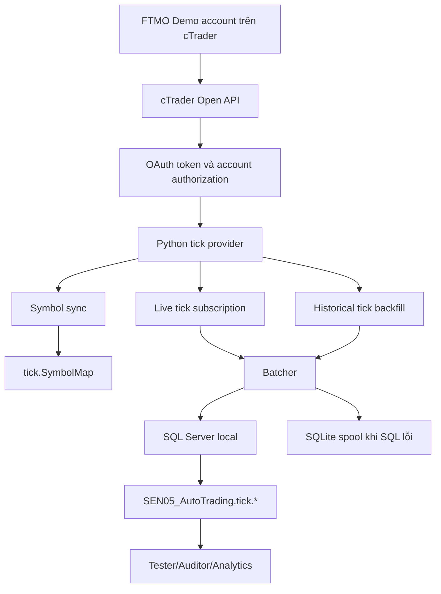

# Báo cáo dự án lấy dữ liệu tick cTrader/FTMO cho SEN05

Cập nhật: 2026-06-08  
Phạm vi: Data Provider mới để lấy dữ liệu tick từ tài khoản FTMO Demo qua cTrader Open API và lưu vào SQL Server local của SEN05.

## 1. Tóm tắt cho tester và auditor

Dự án này tạo một nhánh Data Provider mới, độc lập với pipeline TradingView/Capital.com đang có. Mục tiêu là lấy dữ liệu tick real-time và historical tick từ tài khoản FTMO Demo đăng nhập qua cTrader, sau đó lưu vào SQL Server local trong database `SEN05_AutoTrading`.

Điểm quan trọng nhất:

- Không tạo database mới. Hệ thống dùng lại database local hiện có: `SEN05_AutoTrading`.
- Tạo schema riêng tên ngắn là `tick`.
- Dùng lại `SymbolID` hiện tại của SEN05 để dữ liệu tick sau này có thể đối chiếu với dữ liệu OHLCV.
- Mỗi symbol có một bảng tick riêng: ví dụ `tick.US30`, `tick.GOLD`, `tick.BTCUSD`.
- Python tick provider nằm riêng trong `data_provider/tickdata_ctrader_ftmo/`.
- App wrapper nằm ở `data_provider/apps/ctrader_ftmo_tick.py`.
- Hệ thống đã được kiểm thử offline, kiểm thử SQL local, và đã có smoke write vào `tick.IngestRun`.
- Chưa thể chạy live từ cTrader vì cTrader Open API application hiện vẫn ở trạng thái `Submitted`, chưa `Active`.

Kết luận hiện tại: phần nền tảng trong SEN05 đã sẵn sàng để tiếp tục khi cTrader app được duyệt. Blocker còn lại là bước bên ngoài hệ thống: Spotware/cTrader cần chuyển application sang trạng thái `Active` để OAuth/token hoạt động.

## 2. Bài toán cần giải quyết

SEN05 hiện đang có pipeline lấy dữ liệu OHLCV dạng nến từ TradingView/Capital.com. Dữ liệu đó phù hợp cho chart, dashboard, strategy signal và backtest ở mức bar/candle.

Nhưng tick data là loại dữ liệu khác:

- Tick là từng thay đổi giá nhỏ nhất mà broker gửi về.
- Một tick có thể chỉ cập nhật bid, chỉ cập nhật ask, hoặc cập nhật cả hai.
- Tick data cần lưu liên tục, đặc biệt với BTCUSD vì thị trường hoạt động gần như 24/7.
- Dữ liệu tick phục vụ kiểm định spread, slippage, execution logic, độ trễ và backfill chi tiết hơn nến.

Vì vậy không nên nhét raw tick vào `DWH.Fact_OHLCV`. Tick provider được tách thành một nhánh riêng để không làm rủi ro pipeline cũ.

## 3. Phạm vi symbol ban đầu

Giai đoạn đầu lấy 11 symbol:

| SymbolID | SEN05 symbol | Nhóm |
|---:|---|---|
| 2 | FR40 | Indice |
| 3 | DE40 | Indice |
| 4 | HK50 | Indice |
| 5 | J225 | Indice |
| 6 | SP35 | Indice |
| 7 | UK100 | Indice |
| 8 | US500 | Indice |
| 9 | US100 | Indice |
| 10 | US30 | Indice |
| 56 | GOLD | Metal |
| 81 | BTCUSD | Crypto |

Các symbol này lấy từ config hiện tại của SEN05. Tên symbol phía cTrader/FTMO không được đoán cứng trong code. Hệ thống sẽ gọi API để lấy danh sách symbol thật của tài khoản, sau đó match vào `tick.SymbolMap`.

Lý do phải match symbol: cùng một thị trường có thể được broker đặt tên khác nhau, ví dụ GOLD có thể là `XAUUSD`, US500 có thể là `US500`, `SPX500` hoặc biến thể khác. Nếu gọi sai tên hoặc sai `CTraderSymbolId`, hệ thống sẽ không subscribe được tick.

## 4. Kiến trúc tổng thể



Cách đọc sơ đồ:

1. Tài khoản FTMO Demo là nguồn dữ liệu.
2. cTrader Open API là cổng kết nối chính thức.
3. OAuth tạo access token để app được phép đọc thông tin account và market data.
4. Python tick provider điều phối toàn bộ quá trình.
5. `symbol-sync` đối chiếu symbol nội bộ SEN05 với symbol thật của cTrader.
6. Live tick và historical tick đi qua batcher để ghi SQL theo lô.
7. Nếu SQL tạm thời lỗi, tick được giữ trong SQLite spool để tránh mất dữ liệu ngay lập tức.

## 5. Nguyên tắc thiết kế

### 5.1. Tách khỏi pipeline TradingView hiện tại

Pipeline cũ vẫn dùng cho OHLCV:

`TradingView/Capital.com -> SEN staging -> DWH.Fact_OHLCV -> core_python`

Pipeline mới dành riêng cho tick:

`cTrader/FTMO -> data_provider/tickdata_ctrader_ftmo -> tick.*`

Hai nhánh dùng chung database và `SymbolID`, nhưng không dùng chung bảng dữ liệu chính. Cách này giảm rủi ro làm hỏng hệ thống đang chạy.

### 5.2. Không hard-code tên symbol cTrader

Code chỉ biết 11 symbol nội bộ của SEN05. Tên và ID thật trên cTrader sẽ được lấy từ API rồi lưu vào `tick.SymbolMap`.

Trước khi live ingest, operator phải chạy `symbol-sync --apply` để xác nhận mapping. Nếu symbol còn `PENDING`, `AMBIGUOUS` hoặc `NOT_FOUND`, không nên chạy live cho symbol đó.

### 5.3. Lưu raw data càng đầy đủ càng tốt

Tick table lưu cả dữ liệu raw và dữ liệu đã scale:

- `BidRaw`, `AskRaw`: giá integer từ cTrader.
- `Bid`, `Ask`: giá decimal đã scale.
- `Mid`: giá giữa bid và ask, computed column trong SQL.
- `Spread`: ask trừ bid, computed column trong SQL.
- `QuoteType`: BID, ASK, BOTH hoặc TECHNICAL.
- `SourceMode`: LIVE hoặc HISTORICAL.
- `EventHash`: khóa chống trùng.
- `IngestRunID`: run nào đã ghi tick này.

### 5.4. Idempotency và chống trùng

`EventHash` được tính từ bản thân market event: symbol, cTrader symbol id, timestamp, bid raw, ask raw và quote type.

Sau audit, `SourceMode` đã được loại khỏi `EventHash`. Nghĩa là nếu cùng một tick xuất hiện trong cả live và historical backfill, SQL sẽ xem đó là cùng một event và không nhân đôi dữ liệu. `SourceMode` vẫn được lưu trong row để biết tick đến từ live hay backfill.

### 5.5. Có cơ chế giữ dữ liệu khi SQL lỗi

Tick provider có SQLite spool local. Khi SQL Server lỗi hoặc ghi batch thất bại, hệ thống có thể đẩy tick vào spool để giữ lại, rồi drain lại khi SQL phục hồi.

Spool không thay thế monitoring production. Nó là lớp giảm mất mát dữ liệu trong lỗi ngắn hạn.

## 6. Kiến trúc SQL

Script chính:

`data_provider/sql/07_ctrader_ftmo_tick.sql`

Script này được thêm vào installer tổng:

`data_provider/sql/00_run_all.sql`

Điều này giải quyết finding P1 của auditor: fresh install bây giờ sẽ tạo luôn schema tick, không phải nhớ chạy thủ công file `07`.

### 6.1. Schema

Schema mới:

`tick`

Tên schema ngắn vì database đã là `SEN05_AutoTrading`, không cần lặp lại tên dài như `TickData_cTrader_FTMO`.

### 6.2. Metadata tables

| Bảng | Vai trò |
|---|---|
| `tick.AccountProfile` | Lưu thông tin account cTrader/FTMO đã thấy qua API. |
| `tick.SymbolMap` | Bản đồ giữa `SymbolID` SEN05 và symbol thật trên cTrader. |
| `tick.IngestRun` | Mỗi lần chạy live, smoke hoặc backfill tạo một run record. |
| `tick.IngestState` | Trạng thái mới nhất theo từng symbol: tick cuối, heartbeat, lỗi, tổng số tick. |

`tick.IngestRun` hiện có thêm:

- `RowsInserted`: số tick ghi thành công trong run.
- `RowsSpooled`: số tick phải đưa vào SQLite spool trong run.

Hai cột này được thêm vì auditor chỉ ra rằng nếu chỉ nhét số liệu vào `StopReason` thì máy khó đọc, khó monitor và khó audit.

### 6.3. Tick tables theo symbol

Các bảng tick ban đầu:

- `tick.FR40`
- `tick.DE40`
- `tick.HK50`
- `tick.J225`
- `tick.SP35`
- `tick.UK100`
- `tick.US500`
- `tick.US100`
- `tick.US30`
- `tick.GOLD`
- `tick.BTCUSD`

Mỗi bảng có cùng cấu trúc. Một dòng là một tick đã chuẩn hóa.

### 6.4. Views

| View | Vai trò |
|---|---|
| `tick.v_SymbolMap` | Xem mapping symbol dễ hơn. |
| `tick.v_IngestHealth` | Xem health theo symbol: trạng thái, tick cuối, heartbeat, lỗi. |

## 7. Kiến trúc Python

Folder chính:

`data_provider/tickdata_ctrader_ftmo/`

Các file trong folder này chỉ phục vụ tick provider cTrader/FTMO, không trộn vào pipeline TradingView.

| File | Chức năng |
|---|---|
| `__init__.py` | Đánh dấu package Python. |
| `settings.py` | Đọc config, token cache, endpoint demo/live, danh sách symbol. |
| `models.py` | Model dữ liệu: `TargetSymbol`, `RemoteSymbol`, `TickRecord`, scale giá, hash chống trùng. |
| `symbol_matcher.py` | Match symbol SEN05 với symbol cTrader bằng alias và điểm số. |
| `history.py` | Chia cửa sổ historical tick và decode delta tick từ API. |
| `spool_sqlite.py` | SQLite spool để giữ tick nếu SQL write lỗi. |
| `store_sql.py` | Ghi SQL Server, start/finish ingest run, upsert symbol map, update ingest state. |
| `batcher.py` | Gom tick theo batch, flush theo size/time, xử lý spool. |
| `auth.py` | Tạo OAuth URL, exchange code, refresh token. |
| `oauth_flow.py` | Local callback flow ở `http://localhost:8765/callback`. |
| `token_store.py` | Lưu token cache local, trả trạng thái token mà không in secret. |
| `sdk.py` | Wrapper nhỏ quanh official `ctrader-open-api` SDK. |
| `service.py` | Orchestrate account-list, symbol-sync, live ingest, historical backfill. |
| `cli.py` | Command line interface cho operator/tester. |

Wrapper app:

`data_provider/apps/ctrader_ftmo_tick.py`

Wrapper này giúp chạy tick provider giống các app khác trong `data_provider/apps/`.

## 8. File đã tạo mới

| File/folder | Trạng thái | Mục đích |
|---|---|---|
| `data_provider/sql/07_ctrader_ftmo_tick.sql` | Tạo mới | Tạo schema `tick`, metadata tables, tick tables, views. |
| `data_provider/apps/ctrader_ftmo_tick.py` | Tạo mới | App entrypoint để chạy CLI tick provider. |
| `data_provider/tickdata_ctrader_ftmo/` | Tạo mới | Package riêng cho cTrader/FTMO tick provider. |
| `tests/test_ctrader_ftmo_tickdata.py` | Tạo mới | Test offline cho tick provider. |
| `docs/ctrader_ftmo_tick_data_provider_report.md` | Tạo mới/cập nhật | Báo cáo dự án cho tester/auditor. |

## 9. File đã mở rộng

| File | Nội dung mở rộng |
|---|---|
| `config.py` | Thêm config cTrader/FTMO tick provider, token/env variables, 11-symbol universe. `SQL_SERVER` đã chuyển sang đọc từ env với default `localhost`. |
| `README.md` | Cập nhật SQL Server default, thêm `SQL_SERVER=localhost`, thêm script `07_ctrader_ftmo_tick.sql`, mô tả schema `tick.*`. |
| `data_provider/sql/00_run_all.sql` | Thêm include `07_ctrader_ftmo_tick.sql` để fresh install tạo luôn schema tick. |
| `tests/test_sql_installer_contract.py` | Thêm assertion đảm bảo `00_run_all.sql` không bỏ sót script tick. |

Không chỉnh sửa logic OHLCV cũ trong `pipeline.py`, `ws_live.py`, `checker.py`, `core_python` hoặc strategy runtime.

## 10. Workflow vận hành dự kiến

### Bước 0 - Chuẩn bị SQL local

Fresh install:

```powershell
sqlcmd -S localhost -d master -E -C -b -i data_provider\sql\00_run_all.sql
```

Hoặc nếu database đã tồn tại và chỉ cần nâng schema tick:

```powershell
sqlcmd -S localhost -d master -E -C -b -i data_provider\sql\07_ctrader_ftmo_tick.sql
```

### Bước 1 - Kiểm tra config

```powershell
python data_provider/apps/ctrader_ftmo_tick.py show-config
```

Mục tiêu:

- Environment là `demo`.
- Schema là `tick`.
- Endpoint là `demo.ctraderapi.com:5035`.
- Có đủ 11 symbol mục tiêu.

### Bước 2 - OAuth

Khi cTrader Open API application đã `Active`, chạy:

```powershell
python data_provider/apps/ctrader_ftmo_tick.py oauth-login
```

Flow này mở quyền OAuth, nhận callback local tại:

`http://localhost:8765/callback`

Token cache local nằm ở:

`data_provider/runtime/cache/ctrader_ftmo_oauth.json`

Lưu ý bảo mật: report này không ghi client secret, password, access token hoặc refresh token.

### Bước 3 - Kiểm tra token

```powershell
python data_provider/apps/ctrader_ftmo_tick.py token-status
```

Lệnh này chỉ in trạng thái token có/không, không in secret.

### Bước 4 - Lấy account list

```powershell
python data_provider/apps/ctrader_ftmo_tick.py account-list
```

Mục tiêu là xác nhận account FTMO Demo đúng tài khoản cần dùng, sau đó cache `ctidTraderAccountId`. Đây là ID nội bộ cTrader Open API, không nhất thiết giống broker login hiển thị trên UI.

### Bước 5 - Symbol sync

Chạy dry run trước:

```powershell
python data_provider/apps/ctrader_ftmo_tick.py symbol-sync
```

Nếu mapping hợp lý:

```powershell
python data_provider/apps/ctrader_ftmo_tick.py symbol-sync --apply
```

Sau bước này, `tick.SymbolMap` phải có các symbol `MATCHED` trước khi live ingest.

### Bước 6 - Controlled smoke test

Smoke test chỉ nên chạy khi operator đồng ý rõ 4 điều kiện:

1. Giới hạn thời lượng, ví dụ 5 phút, không chạy qua đêm unattended.
2. Không chạy bất kỳ lệnh `backfill` nào trong cùng session.
3. Tick thu được không dùng để ra quyết định trading.
4. `tick.IngestRun` phải được label rõ là smoke/non-production.

Lệnh live smoke dự kiến:

```powershell
python data_provider/apps/ctrader_ftmo_tick.py live --smoke-seconds 300
```

Khi dùng option này, `tick.IngestRun` được tạo với app/run label `SMOKE`, note non-production và thời lượng được cap theo số giây truyền vào.

### Bước 7 - Production 24/7

Production 24/7 chỉ nên bật sau khi hoàn tất các điều kiện còn lại:

- cTrader app đã `Active`.
- OAuth/token đã chạy ổn.
- `symbol-sync --apply` đã mapping đúng.
- Môi trường Python production dùng Python 3.11 hoặc 3.12 với Windows `IocpReactor`/`twisted-iocpsupport`.
- Có cơ chế refresh token/alert trước khi token hết hạn.
- Có monitor cho `tick.v_IngestHealth`, `tick.IngestRun`, SQLite spool và process uptime.

### Bước 8 - Historical backfill

Backfill phụ thuộc giới hạn thực tế của cTrader API theo từng symbol/account. Theo tài liệu Open API, request tick data cần chia cửa sổ ngắn, hiện code đang chia theo window tối đa một tuần.

Không chạy backfill trước khi:

- App Active.
- Token hợp lệ.
- SymbolMap đã `MATCHED`.
- Chính sách overlap live/history đã được thống nhất.
- Tester xác nhận không dùng dữ liệu backfill chưa kiểm định cho trading.

## 11. CLI chính

Các command đã chuẩn bị:

| Command | Mục đích |
|---|---|
| `show-config` | In config vận hành không lộ secret. |
| `token-status` | Kiểm tra token cache/env có đủ chưa. |
| `auth-url` | Tạo URL OAuth thủ công nếu cần. |
| `exchange-code` | Đổi authorization code lấy token. |
| `oauth-login` | Tự động local OAuth callback. |
| `refresh-token` | Refresh access token bằng refresh token. |
| `account-list` | Lấy danh sách account được cấp quyền. |
| `symbol-sync` | Match symbol cTrader với SEN05. |
| `live` | Subscribe live tick. Có `--smoke-seconds N` để chạy smoke test có giới hạn thời gian. |
| `backfill` | Kéo historical tick theo window. |

## 12. Xử lý rủi ro và an toàn hệ thống

### Rủi ro 1 - Ghi nhầm bảng hoặc SQL injection qua tên symbol

Biện pháp:

- Chỉ cho phép symbol nằm trong danh sách cấu hình.
- SQL identifier được whitelist bằng regex.
- Table name được quote bằng `[schema].[table]`.
- Không nhận table name tự do từ user input.

### Rủi ro 2 - Tick duplicate do reconnect hoặc overlap live/history

Biện pháp:

- Mỗi tick có `EventHash`.
- Mỗi bảng tick có unique index trên `EventHash` với `IGNORE_DUP_KEY = ON`.
- `SourceMode` không còn tham gia vào hash, nên live và historical cùng một market event không tạo duplicate.

### Rủi ro 3 - SQL Server tạm thời lỗi

Biện pháp:

- Batcher ghi theo batch.
- Nếu ghi SQL fail, tick có thể được đưa vào SQLite spool.
- Spool có thể drain lại khi SQL phục hồi.
- `RowsSpooled` được ghi vào `tick.IngestRun` để auditor thấy được run nào có sự cố.

### Rủi ro 4 - Symbol mapping sai

Biện pháp:

- Không hard-code tên symbol cTrader.
- `symbol-sync` lưu `MappingStatus`, `MappingScore`, `Notes`.
- Mapping mơ hồ sẽ là `AMBIGUOUS`, không tự coi là an toàn.
- `PipPosition` được populate từ cTrader metadata để phục vụ phân tích spread/pip về sau.

### Rủi ro 5 - Token hết hạn làm ingest dừng

Hiện trạng:

- Token cTrader theo tài liệu có lifetime dài hơn OAuth generic thông thường, nhưng production 24/7 vẫn cần refresh/alert.
- Đã có CLI `refresh-token`, nhưng chưa biến thành daemon/monitor production.

Điều kiện trước production:

- Tự refresh token trước khi hết hạn.
- Nếu refresh fail, phải có alert.
- Nếu refresh token cũng hết hiệu lực, operator phải biết cần chạy lại OAuth.

### Rủi ro 6 - Reactor không tối ưu trên Windows production

Hiện trạng:

- Dev venv hiện tại chạy Python 3.14.
- Production với cTrader SDK/Twisted trên Windows nên dùng Python 3.11/3.12 và `IocpReactor`.
- Đây là blocker trước production 24/7, nhưng không chặn smoke test ngắn nếu operator chấp nhận risk.

### Rủi ro 7 - Dữ liệu smoke bị hiểu nhầm là production

Biện pháp:

- Smoke run phải có label rõ trong `tick.IngestRun`.
- Không dùng tick smoke cho trading decision.
- Không chạy qua đêm unattended.
- Không chạy backfill trong smoke session.

## 13. Tình trạng audit hiện tại

| Nhóm | Finding | Trạng thái |
|---|---|---|
| P1 | `00_run_all.sql` bỏ sót schema tick | Đã fix. `07_ctrader_ftmo_tick.sql` đã được include. |
| P1 | `SQL_SERVER` hard-code | Đã fix. `SQL_SERVER` đọc env, default `localhost`. |
| P1 | README lệch runtime SQL | Đã fix. README đã cập nhật default SQL và script `07`. |
| P2 | Thiếu metric ingest đọc được bằng máy | Đã fix. Thêm `RowsInserted`, `RowsSpooled` vào SQL và Python store. |
| P2 | Live/historical overlap tạo duplicate | Đã fix. `SourceMode` không còn nằm trong `EventHash`. |
| P2 | Windows reactor cho production | Còn mở. Cần xử lý trước production 24/7. |
| P2 | Token refresh/alert production | Còn mở. Có CLI refresh, chưa có daemon/alert. |
| P3 | `PipPosition` chưa populate | Đã fix. `RemoteSymbol`, SDK extractor và SQL upsert đã hỗ trợ. |
| P3 | OAuth dùng GET | Đóng. Đây là spec của cTrader token endpoint theo implementation hiện tại. |

## 14. Kết quả kiểm thử và bằng chứng

Đã chạy trong workspace local:

| Kiểm thử | Kết quả |
|---|---|
| Ruff cho tick provider, wrapper, config và tests liên quan | Passed |
| Compile Python package tick provider | Passed |
| Targeted tests `tests/test_ctrader_ftmo_tickdata.py` và `tests/test_sql_installer_contract.py` | `23 passed` |
| Full pytest repo | `144 passed` |
| Apply SQL `07_ctrader_ftmo_tick.sql` vào SQL Server local | Passed |
| Kiểm tra `tick.IngestRun` có `RowsInserted`, `RowsSpooled` | Passed |
| Kiểm tra `tick.SymbolMap` | 11 rows, 0 matched, 11 pending |
| Kiểm tra số bảng base trong schema `tick` | 15 tables |
| Python `modules.db_connector.test_connection()` | Passed |
| Smoke write `TickSqlStore.start_ingest_run/finish_ingest_run` | Passed, row ghi `RowsInserted=7`, `RowsSpooled=2` |

Giải thích số bảng `tick`:

- 4 metadata tables: `AccountProfile`, `SymbolMap`, `IngestRun`, `IngestState`.
- 11 tick tables theo symbol.
- Tổng base tables: 15.

## 15. Hiện trạng blocker live

Blocker chính không nằm trong code SEN05:

- cTrader Open API application vẫn đang ở trạng thái `Submitted`.
- Khi app chưa `Active`, OAuth bị chặn với lỗi kiểu `OA client is not in active state`.
- Chưa có access token hợp lệ nên chưa thể gọi `account-list`, `symbol-sync --apply`, `live` hoặc `backfill`.

Không nên tạo thêm nhiều application nếu không có lý do rõ ràng, vì có thể làm quy trình duyệt rối hơn. Hướng hợp lý hiện tại là chờ app hiện tại được duyệt hoặc liên hệ support nếu quá hạn KYC theo thông báo của cTrader.

## 16. Các bước tiếp theo sau khi app Active

1. Chạy `oauth-login` để lấy token.
2. Chạy `token-status` để xác nhận token cache hợp lệ.
3. Chạy `account-list` để xác nhận đúng FTMO Demo account.
4. Chạy `symbol-sync`, audit mapping.
5. Nếu mapping ổn, chạy `symbol-sync --apply`.
6. Chạy controlled smoke test ngắn, có label rõ trong `tick.IngestRun`.
7. Đọc `tick.v_IngestHealth`, `tick.IngestRun`, một vài bảng tick như `tick.US30`, `tick.GOLD`, `tick.BTCUSD`.
8. Chỉ sau smoke thành công mới tính historical backfill.
9. Trước production 24/7, xử lý reactor, token refresh/alert và process monitoring.

## 17. Gợi ý checklist cho tester

Tester có thể kiểm theo thứ tự:

1. `00_run_all.sql` có include `07_ctrader_ftmo_tick.sql`.
2. Database local có schema `tick`.
3. `tick.SymbolMap` có đúng 11 symbol.
4. Các bảng `tick.US30`, `tick.GOLD`, `tick.BTCUSD` tồn tại.
5. `tick.IngestRun` có cột `RowsInserted`, `RowsSpooled`.
6. `token-status` không in secret.
7. `symbol-sync` không tự apply khi chưa yêu cầu.
8. Nếu smoke live chạy được, `RowsInserted` tăng và `tick.v_IngestHealth` có heartbeat.
9. Nếu cố tình ngắt SQL trong môi trường test, spool có ghi dữ liệu và `RowsSpooled` phản ánh sự cố.

## 18. Gợi ý checklist cho auditor

Auditor nên tập trung vào:

1. Tính cô lập: tick provider không làm thay đổi logic OHLCV cũ.
2. Fresh install: `00_run_all.sql` tạo đủ schema tick.
3. Bảo mật credential: không có password/token/client secret hard-code trong repo.
4. SQL safety: dynamic table name có whitelist.
5. Idempotency: `EventHash` chống duplicate và không phân biệt live/history.
6. Observability: `IngestRun`, `IngestState`, `RowsInserted`, `RowsSpooled`.
7. Symbol correctness: không chạy live nếu mapping còn ambiguous.
8. Production readiness: reactor, token refresh, monitoring, backfill policy.

## 19. Cách hiểu để có thể "vibe code" lại hệ thống

Nếu cần giải thích thật ngắn cho người mới:

SEN05 cũ lưu nến. Dự án này thêm một đường ống mới để lưu tick. Đường ống mới vẫn dùng cùng database và cùng mã số symbol, nhưng cất dữ liệu tick vào khu riêng tên `tick`. Python chỉ đóng vai trò người vận hành: xin quyền OAuth, hỏi cTrader xem account có symbol nào, ghép symbol đó với symbol SEN05, subscribe tick, gom tick thành batch, ghi SQL, và nếu SQL lỗi thì để tạm vào spool.

Khi muốn code thêm tính năng, hãy hỏi 5 câu:

1. Tính năng này thuộc tick provider hay pipeline OHLCV cũ?
2. Nó cần chạm SQL schema, Python runtime hay chỉ report/monitor?
3. Nó có làm mất tính idempotent của `EventHash` không?
4. Nó có làm tăng rủi ro ghi nhầm symbol/table không?
5. Nó có cần chạy được 24/7 hay chỉ phục vụ smoke/backfill có kiểm soát?

Prompt mẫu để làm việc tiếp với AI/coder:

```text
Hãy đọc data_provider/tickdata_ctrader_ftmo và data_provider/sql/07_ctrader_ftmo_tick.sql.
Không đụng pipeline OHLCV cũ.
Mục tiêu là thêm [tính năng].
Phải giữ SymbolID hiện tại, schema tick, whitelist table name, EventHash idempotency,
SQLite spool, và không hard-code credential.
Sau khi sửa, chạy ruff, targeted tests, full pytest, và nếu có SQL migration thì apply vào SQL Server local.
```

## 20. Kết luận

Phần SEN05 local cho cTrader/FTMO tick data đã được xây nền đầy đủ: schema SQL, package Python, CLI, OAuth flow, symbol matching, batch write, spool, tests và report. Các finding P1 đã được xử lý. Các vấn đề P2 liên quan duplicate live/history và ingest metrics cũng đã được xử lý.

Việc còn thiếu để lấy dữ liệu trực tiếp không phải là thêm bảng hay thêm file Python chính, mà là hoàn tất điều kiện vận hành bên ngoài: cTrader application phải `Active`, token phải lấy được, account phải xác nhận đúng, symbol phải sync đúng, rồi mới chạy smoke test có giới hạn.
